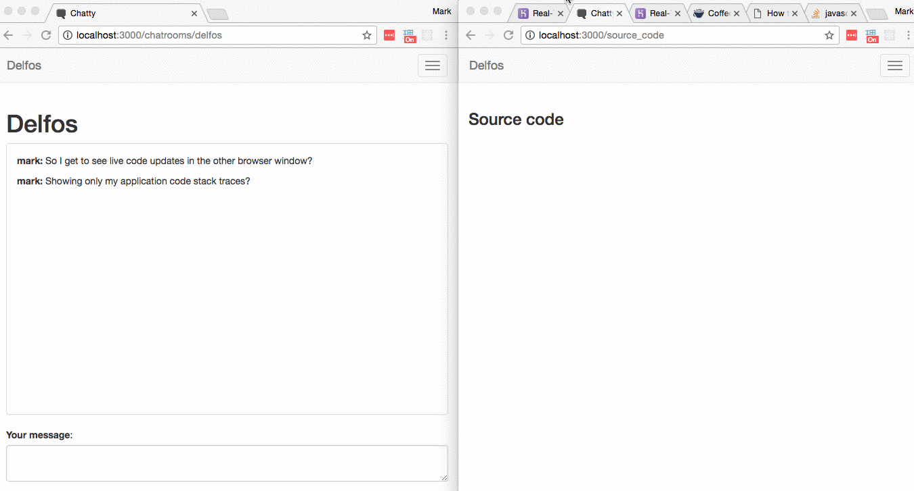

## Delfos call site logging example

See it in action here:

This app is adapted from https://github.com/SophieDeBenedetto/action-cable-example

See Sophie's blog post for details of Action Cable:
https://blog.heroku.com/archives/2016/5/9/real_time_rails_implementing_websockets_in_rails_5_with_action_cable

This example uses [Delfos](https://github.com/markburns/delfos) for call site logging and Rails 5's action cable for pushing live updates of call sites to 
another browser.

For this to work from the terminal too (or any other Rails instance) you need to follow the instructions
for getting started with redis.

